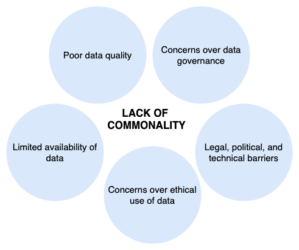

# Welcome to the Medical Data Universe (MDU) repository! 

MDU is an open-access repository to support sharing of COVID-19 data. If you are interested in using real-world data for research or in contributing data for the betterment of society, then you are at the right place. 

## Background ##

Ever since the World Health Organization declared the COVID-19 pandemic, there have been numerous calls **to accelerate and improve data sharing**. Nonprofit organizations, universities, and other institutions worldwide are turning to **artificial intelligence (AI) to better understand the disease and its impact on human health**. However, AI models require **a lot of data** both during training to compute accurate predictions and during testing to **ensure generalizability** across unseen cohorts. Although data sharing is seen now, more than ever, as an ethical and moral obligation in research, there are many **obstacles that hinder** the process, including the limited availability of data, poor data quality, concerns over data governance, concerns over ethical use of data, bureaucratic barriers, and an overarching **lack of commonality**. 

There exists many notable initiatives that aim to improve sharing of medical data at local, national, and international levels. We compiled a list [here for reference](files/list-of-data-platforms.csv). We summarize the process to share/access data and incentives to share data. Yet, this hyper-fragmentation of efforts is challenging. A **collaborative and open approach** is much needed to allow researchers to access and use data and software to tackle challenges related to healthcare, especially in the context of COVID-19.

## Project summary ##

MDU is an open repository of de-identified clinical data related to COVID-19, which may include, but is not limited to, patient data and clinical trials data. Through this repository, we hope to facilitate data access and accelerate AI research on COVID-19 diagnosis, prognosis, and management. Data is available for use for research purposes only. For commercial uses, please email us at <datasharing.ignite@gmail.com>.

## Who we are :two_women_holding_hands::two_women_holding_hands::two_women_holding_hands: ## 

We are a team of six women who are passionate about making the world a better place through democratizing access to medical data for research. 
| | | |
|:-------------------------:|:-------------------------:|:-------------------------:|
|  **Annie Mathew** |   **Cynthia Ike** | **Farah Shamout** |
| Director Developer Relations, Microsoft Asia Pacific |  Executive Director, Circuit Pointe | Assistant Professor Emerging Scholar, NYU Abu Dhabi |
| **Manal Alomary**  |  **Maram Abadi** | **Trisha Black** |
| Director of Operations and Medical Affairs, Altibbi |  Postdoctoral Research Fellow, KAUST | Manager, Analyst Relations & Strategy, IBM |

## Types of data ##
De-identified clinical and demographical data of COVID patients from across all countries and healthcare sectors.

## Interested in contributing? ## 

* Read and accept the terms and conditions below. 
* Create a folder under /datasets with the following label: "LastnameMonthYear"
* Remove all protected health information from your dataset before uploading (a list of US specific HIPAA protected information can be found [here](files/phi.md)), all datasets should be de-identified in accordance with the Safe Harbor method before submission. For a comprehensive guide for de-identifying your data visit the link [here](https://www.hhs.gov/hipaa/for-professionals/privacy/special-topics/de-identification/index.html#standard). Note that other jurisdictions may have other data de-identifying standards.
* Submit the data directly to the project.
* Include a README file that includes (we also provided a template for you to use in /datasets): 
  * Standards used to de-identify data (e.g., HIPAA).
  * A title and a brief description of the dataset.
  * Any references to relevant studies that must be cited.
  * A statement that the study protocol was approved by relevant Institutional Review Boards (IRBs) or ethics committees. If human participants gave written informed consent, then please state this.
  * For clinical trials: Please specify trial registration number and registry name.
  * See the suggested [Schema.md](https://github.com/datasharing-forbesignite/medical-data-universe/blob/c654bbb24787a0010f1ad8ec53a392fb942ea0a3/Schema.MD "Schema.MD") for more information on the metadata schema.

### Formats ###
To ensure accessibility of data, we’ll accept data formats that are universally used. Accepted data formats:

Datasets  | Extension
------------- | -------------
SPSS data files  | .sav
Stata data files  | .dta
R  | .rdata
Excel  | .xlsx
Delimited |  .csv; .tab
Images | .dcm; .png; .jpeg

If you have a different format from the data types listed above, please reach out!

### How to increase the accessibility and reusability of your data ###
* Give each column a descriptive heading.
* When sharing datasets with multiple files or tables, submit each file/table as a seperate file. Give each data file a name that appropriately reflects its content.
* Do not use color coding (machine-based data mining cannot interpret this).

## Terms and conditions ##

The Medical Data Universe (MDU) is intending to establish a relationship between individuals and the MDU github repository for the purposes of managing the data sharing on the individual’s behalf. It provides complete control over the collected copy of the participant’s data to others. 
* By sharing data through this platform on git, any data pulled and pushed from the repository is accessible based github processes and you are agreeing to host your dataset here.
* This does not authorize the MDU github repository to function as a healthcare provider. 
* The participant’s copy of medical data does not replace existing provider-maintained records that law and regulation require healthcare providers to maintain, nor does it have any impact on provider responsibility to report public health data or perform any other functions related to medical records as may be required by law. 
* The individual and MDU, authorizes MDU, on participant’s behalf, to acquire, receive, collective, maintain, share, and delete the medical data as granted pursuant to this Agreement once the data shared through the MDU github repository.
* Participant must cite the original source of the shared data. 
* MDU shall not use or further disclose Participant’s data, either in whole or in part, other than as permitted by this Agreement.

## Reference ## 
If you use our repository or find it useful at all, don't forget to give our repository a :star:! 

## Acknowledgements ##
We would like to thank all of those who contributed to the fruition of our idea. We would also link to express our gratitude to the Forbes Ingite Fellowship for bringing our team together and providing valuable resources.
